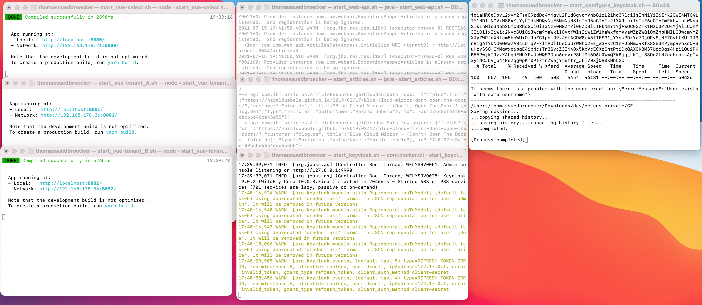

# UNDER CONSTRUCTION

### Objective

Getting started to implement an example microservices based application for multi tenancy. A basic use case for the example usage needs to be defined. 

The starting point from the technical and usage perspective is this workshop [`Get started to deploy a Java Microservices application to Code Engine`](https://suedbroecker.net/2021/05/28/new-hands-on-workshop-get-started-to-deploy-a-java-microservices-application-to-code-engine/).

#### Planned next steps

The plan will be changed, if needed.

| Task | State | Comments|
| --- | --- | --- |
|Get it working on the local machine | **done** | simplified for the basic Use Case  |
| Deploy it to Code Engine | **open** |   |
| Redefine the use case and technology | **open** |   |
| Plan to implement with redefined use case and technology | **open** |   |

### Basic Use Case

#### Short Description 

Get articles displayed based on your email domain, user role and user authentication and authorization.

#### Basic Flow

1. Insert email address
2. Based on the domain of your email address you are routed to the right tenant (examples `blog.de` and `blog.com`)
3. Login to the right realm on the identity and access management system
4. The articles are displayed according to the user role and tenant.


Here an example basic flow implementation at the local machine.


### Architecture

* Basic dependencies (local machine)


The gif shows a basic overview of following sequence:

1. Invoke `web-app-select` on `port 8080` and insert your email to select the domain for the tenant ((blog.de == tenantA) and (blog.com == tenantA))

2. The related webfronted for `blog.de` is invoked, it's `web-app-tenant-a` (`port 8081`) that redirects to the right Keycloak realm (tenant-A) which provides the login and returns the access-token. We use that token to access the `web-api` microservice (`port 8083`). Therefor we invoke the `web-api` REST endpoint related to the right tenant (realm), in this case it's tenant-a. (`user:alice;role:user` in both realms)

3. The microservice `web-api` uses the the functionalities for multitenancy [provided by Quarkus](https://quarkus.io/guides/security-openid-connect-multitenancy) for the **validation of the access token** at right Keycloak realm and **forwards the given access-token** to the microservice articles, by using the right REST endpoint for the given tenant.

4. The `articles` microservice does the same validation as `web-api` using [Quarkus](https://quarkus.io/guides/security-openid-connect-multitenancy) and uses the right query to provide the needed articles data from the Cloudant database.

* In this example we use:

    1. Three web applications

         * web-app-select (extract domain)
         * web-app-tenant-a (connect to tenant a)
         * web-app-tenant-b (connect to tenant b)

    2. Two microservices

        * web-api (react based on given tenant)
        * articles (react based on given tenant)

    3. One Identity and Access Management system

        * Keycloak with two custom realms

    4. (optional) One database service on IBM Cloud

        * Cloudant with one Database       

### Technologies

The example application currently uses following technologies.

* Identity and Access Management

    * [Keycloak](https://www.keycloak.org)

* Database

    * [Cloudant](https://www.ibm.com/cloud/cloudant)

* Multi Tenancy
 
    * [Quarkus Security OpenID Connect Multi Tenancy](https://quarkus.io/guides/security-openid-connect-multitenancy) for the Java microservices implementation

* Microservies

    * [Quarkus](https://quarkus.io)
    * Java

* Web frontends:

    * [Vue.js](https://vuejs.org)
    * JavaScript

* Example setup automation

    * Bash


### Run the current example locally

#### Prerequisites

##### Environment

* Local

    * OS: Mac OS
    * Visual Studio Code (optional)

    * You need to you have installed on you MacOS:

        * Java: openjdk version "11.0.11"
        * Docker Desktop: "3.4"
        * Apache Maven: "3.8.1"
        * Vue.js: vue/cli "4.5.13"

#### Steps

You should be able to simply run the example locally.

##### Step 1: Clone the project

```sh
git clone https://github.com/thomassuedbroecker/ce-cns-multi-tenant
cd ce-cns-multi-tenant/CE
```

##### Step 2: Start the example with a bash script

```sh
bash local-start-tenant.sh
```

This bash script will start seven terminals:
 
* Keycloak (port 8282)
* Web-App select (port 8080)
* Web-App tenant A (port 8081)
* Web-App tenant B (port 8082)
* Web-API microservice (port 8083)
* Articles microservice (port 8084)
* Auto configuration of Keycloak (**waits 1 min before the configuration starts**)

The image below shows the terminal sessions:



* two browser sessions
    * Web-App select `http://localhost:8080/` 
    * Keycloak admin `http://localhost:8282/` (admin/admin)

##### Step 3: Select a tenant by inserting a email address in the `Web-App select` 

  Use following:
   
  - `alice@blog.de` for `tenant a`
  - `alice@blog.com` for `tenant b`

##### Step 4: Login to `tenant a` or `tenant b`

  Use following:

  - User: `alice` Password: `alice`

##### Step 5: Logout from `tenant a` or `tenant b`

Because this will clear the saved cookie in the browser from `Keycloak`.

##### Step 6: Login to `Keycloak` master realm

  Use following:

  - User: `admin` Password: `admin`

Verify the two realm configurations tenant-a and tenant-b.


