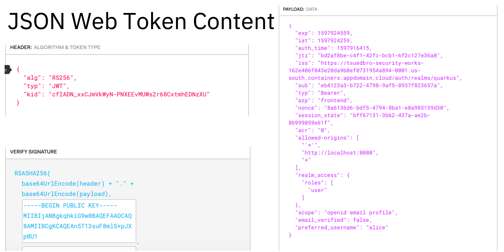
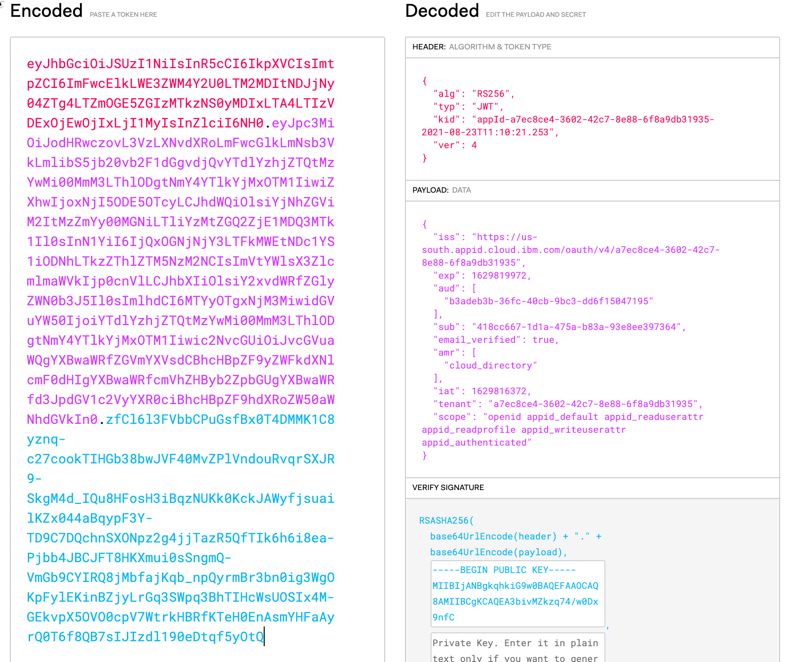

# Compare Keycloak and App ID

### Compare App ID and Keycloak

#### 1) Basic information and links

* Keycloak (is OIDC compliant)
    * [Keycloak REST API](https://www.keycloak.org/docs-api/10.0/rest-api/index.html)
    * [Keycloak Adapters](https://wjw465150.gitbooks.io/keycloak-documentation/content/securing_apps/topics/oidc/javascript-adapter.html)

* App ID (Uses oAuth2 and OIDC)
    * [App ID API documentation](https://cloud.ibm.com/apidocs/app-id/auth)
    * [App ID Management API](https://us-south.appid.cloud.ibm.com/swagger-ui/#/Management%20API%20-%20Cloud%20Directory%20Users)
    * [App ID usage in the Cloud Native Starter project](https://github.com/IBM/cloud-native-starter/blob/master/documentation/DemoAuthentication.md)

#### 2) Table with current findings

| Functionality | Keycloak | IBM Cloud App ID Service|
|---|---|---|
| Configuration of User and Role using the API calls | Possible with the Keycloak API | Possible with the `App ID Admin API` also for "Cloud Directory" |
| Roles | Can be defined and mapped users. The information is also a part a the access token. (example: realm-access.roles.[user]) | Can be defined and mapped users. I wasn't able to find the information as a part of the access token for `singlewebapp`. (example: scope.[...]) I need to verify this for the `webapp`.|
| Configurations different roles in different tenants | Possible using different realms or different groups  | You need different App ID instances |
| Define custom authentication flows| [Yes](https://www.keycloak.org/docs/latest/server_admin/) | No |
| Definition of clients | Free to define own application client types | Predefined two basic client types _(singlewebapp and webapp they providing different JWTs formats )_, which **does impact the start of the appid authentication dialog**. This has an impact that we need to introduce an additional application to map web-app requests to OpenID connect requests (Old cloud native starter example)|
|APIs| provides a management REST API | provides single documented REST API |
|SDKs| provides SDKs for Android, Node.js, Swift, JavaScript | [provides different adapters for Keycloak](https://www.keycloak.org/docs/latest/securing_apps/#_oidc) Java, JavaScript, Node.js|
|[Open ID connect certified](https://openid.net/certification/) | was certified in 2016 by Red Hat | never certified |
| Formats for the `JSON Web Token` access tokens, when using Quarkus | **Keykloak** `JSON Web Token` access tokens is OOTB supported and **can be forwarded** and examined with Annotations like `@RolesAllowed("user")` | **App ID** `JSON Web Token` access tokens **isn't OOTB supported** and **can't be forwarded** and examined with Annotations like `@RolesAllowed("user")` in Quarkus. Maybe we need be redefine some kind of "scope" as "role" information  |
| Logging of activities and problems | You can see this information in the Keycloak server log and console output |You need to add additional service [IBM Cloud Activity Tracker](https://www.ibm.com/cloud/activity-tracker) and [IBM Cloud Logging Service (LogDNA)](https://cloud.ibm.com/catalog/services/logdna) |

