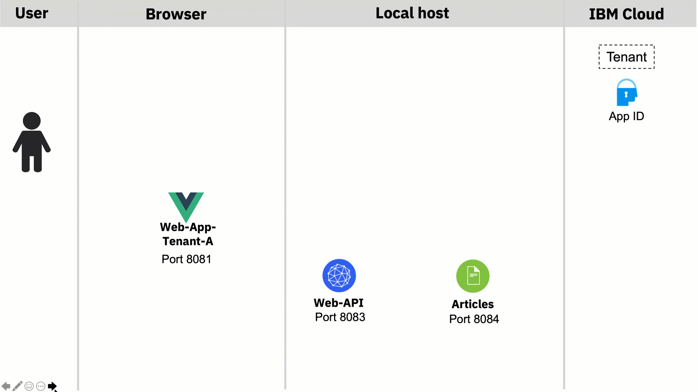

# Extract tenant and reconfigure OIDC configuration with Quarkus for Keycloak

This implementation detail is structured in objective, use case definition, architecture, multi tenancy realization, technologies, and implementation.¶

### Objective¶

I want to start with a very simple microservices based application example for multi tenancy implementation, and for this application is a simple use case defined.

The starting point, from the technical and usage perspective, is this workshop [`Get started to deploy a Java Microservices application to Code Engine`](https://suedbroecker.net/2021/05/28/new-hands-on-workshop-get-started-to-deploy-a-java-microservices-application-to-code-engine/).

### Use Case definition

Show articles based on an email domain, validated by role and user authentication and authorization.

#### Basic Flow

1. Open web applicatoin
3. Login to the App ID
4. The articles are displayed to App ID application.

The following gif shows an example implementation overview of this use case on the local machine.


### Architecture



The gif shows a simplified overview of the dependencies of the architecture in following sequence:

1. Invoke `web-app-select` on `port 8080` and insert your email to select the domain for the tenant ((blog.de == tenantA) and (blog.com == tenantA))
2. The related webfrontend for `blog.de` is invoked, it's `web-app-tenant-a` (`port 8081`) that redirects to the right Keycloak realm (tenant-A) which provides the login and returns the access-token. We use that token to access the `web-api` microservice (`port 8083`). Therefor we invoke the `web-api` REST endpoint related to the right tenant (realm), in this case it's tenant-a. (`user:alice;role:user` in both realms)
3. The microservice `web-api` uses the the functionalities for multitenancy [provided by Quarkus `security openID connect multitenancy`](https://quarkus.io/guides/security-openid-connect-multitenancy) to extract the invoked endpoint from the `rootcontext` and set the right configuration for the given tenant, that means in this case for the `Keycloak realm`. Quarkus also does the **validation of the access token** at right Keycloak realm and **forwards the given access-token** to the microservice articles, by using the right REST endpoint for the given tenant.
4. The `articles` microservice does the same validation as `web-api` using [Quarkus](https://quarkus.io/guides/security-openid-connect-multitenancy) and uses the right query to provide the needed articles data from the Cloudant database.

### Multi tenancy realization

In the given use case following `multi tenancy realization` will be used.

* Variable frontends for each domain
* Microservice using [Quarkus Security OpenID Connect Multi Tenancy](https://quarkus.io/guides/security-openid-connect-multitenancy)
* Database will have an additional entry to separate the domains
* Identity and access management will be managed by different Keycloak realms

### Technologies

The example application currently uses following technologies.

* Identity and Access Management ([Keycloak](https://www.keycloak.org))
* Multi Tenancy ([Quarkus Security OpenID Connect Multi Tenancy](https://quarkus.io/guides/security-openid-connect-multitenancy))
* Microservices  ([Quarkus](https://quarkus.io))
* Web frontend [Vue.js](https://vuejs.org) (Web frontend with JavaScript)
* (Optional a Database) [Cloudant](https://www.ibm.com/cloud/cloudant)

### Implementation

The [Quarkus Security OpenID Connect Multi Tenancy](https://quarkus.io/guides/security-openid-connect-multitenancy) for the  multi tenancy of the java microservices is used for the implementation. Here we focus only on the example implementation for the `web-api` microservice.

These are the steps:

1. Provide a REST endpoint for each tenant
2. Extract the invoked endpoint from the `rootcontext` and set the right configuration in the `CustomTenantConfigResolver` class for the given tenant, that means in this case for the `Keycloak realm`.
3. Based on the known tenant invoke the right endpoint of the `articles service`.
    1. Create REST client for each tenant
    2. Invoke the right client


#### Provide  REST endpoint for each tenant

Relevant code in [ArticleResource.java](https://github.com/thomassuedbroecker/ce-cns-multi-tenant/blob/master/code/web-api-tenant/src/main/java/com/ibm/webapi/ArticleResource.java) of the web-api service.

In this case these are the two endpoints:

* `@Path("/articlesA")`
* `@Path("/articlesB")`

```java
   @GET
    @Path("/articlesA")
    @Produces(MediaType.APPLICATION_JSON)
    //@Authenticated
    @RolesAllowed("user")
    @NoCache
    public List<Article> getArticlesA() {
        try {
            List<CoreArticle> coreArticles = articlesDataAccess.getArticles(5);
            System.out.println("-->log: com.ibm.webapi.ArticleResource.getArticles -> articlesDataAccess.getArticles");
            return createArticleList(coreArticles);
        } catch (NoConnectivity e) {
            System.err.println("-->log: com.ibm.webapi.ArticleResource.getArticles: Cannot connect to articles service");
            throw new NoDataAccess(e);
        }
    }

    @GET
    @Path("/articlesB")
    @Produces(MediaType.APPLICATION_JSON)
    //@Authenticated
    @RolesAllowed("user")
    @NoCache
    public List<Article> getArticlesB() {
        try {
            List<CoreArticle> coreArticles = articlesDataAccess.getArticles(5);
            System.out.println("-->log: com.ibm.webapi.ArticleResource.getArticles -> articlesDataAccess.getArticles");
            return createArticleList(coreArticles);
        } catch (NoConnectivity e) {
            System.err.println("-->log: com.ibm.webapi.ArticleResource.getArticles: Cannot connect to articles service");
            throw new NoDataAccess(e);
        }
    }
```

####  Extract the invoked endpoint and set the right configuration in the CustomTenantConfigResolver¶

Extract the invoked endpoint from the `rootcontext` and set the right configuration in the `CustomTenantConfigResolver` class for the given tenant, that means in this case for the `Keycloak realm`.

Relevant code in [CustomTenantConfigResolver.java](https://github.com/thomassuedbroecker/ce-cns-multi-tenant/blob/master/code/web-api-tenant/src/main/java/com/ibm/webapi/CustomTenantConfigResolver.java) of the `web-api microservice`.

```java
package com.ibm.webapi;

import javax.enterprise.context.ApplicationScoped;

// Tenant
import io.quarkus.oidc.TenantConfigResolver;
import io.quarkus.oidc.OidcTenantConfig;
import io.vertx.ext.web.RoutingContext;

@ApplicationScoped
public class CustomTenantConfigResolver implements TenantConfigResolver {
   
    @Override
    public OidcTenantConfig resolve(RoutingContext context) {
        System.out.println("-->log: com.ibm.web-api.CustomTenantResolver.resolve : " + 
        
        // 1. Extract path
        context.request().path());
        String path = context.request().path();
        String[] parts = path.split("/");

        if (parts.length == 0) {
            // resolve to default tenant configuration
            return null;
        }
        
        // 2. Verify path with given tenant options
        if ("articlesA".equals(parts[1])) {
            OidcTenantConfig config = new OidcTenantConfig();

            System.out.println("-->log: com.ibm.web-api.CustomTenantResolver.resolve A: " + config.getToken().getIssuer().toString());
            
            // 3. Set the right configuration for the Keycloak realm
            config.setTenantId("tenantA");
            config.setAuthServerUrl("http://localhost:8282/auth/realms/tenantA");
            config.setClientId("backend-service");
            OidcTenantConfig.Credentials credentials = new OidcTenantConfig.Credentials();
            credentials.setSecret("secret");
            config.setCredentials(credentials);

            System.out.println("-->log: com.ibm.web-api.CustomTenantResolver.resolve A: " + config.toString());

            return config;
        }

        if ("articlesB".equals(parts[1])) {
            System.out.println("-->log: com.ibm.web-api.CustomTenantResolver.resolve");           
            OidcTenantConfig config = new OidcTenantConfig();
 
            System.out.println("-->log: com.ibm.web-api.CustomTenantResolver.resolve issuer: " + config.getToken().getIssuer().toString());
            
            config.setTenantId("tenantB");
            config.setAuthServerUrl("http://localhost:8282/auth/realms/tenantB");
            config.setClientId("backend-service");
            OidcTenantConfig.Credentials credentials = new OidcTenantConfig.Credentials();
            credentials.setSecret("secret");
            config.setCredentials(credentials);

            System.out.println("-->log: com.ibm.web-api.CustomTenantResolver.resolve B: " + config.toString());

            return config;
        }

        return null;
    }
}
```

#### Based on the known tenant invoke the right endpoint of the articles service

Now we can invoke articles microservice, which is implemented in the same way.

##### 1. Create REST client for each tenant

Relevant code in [ArticlesDataAccess.java](https://github.com/thomassuedbroecker/ce-cns-multi-tenant/blob/master/code/web-api-tenant/src/main/java/com/ibm/webapi/ArticlesDataAccess.java) of the web-api service.

```java
URI apiV1 = null;

        apiV1 = UriBuilder.fromUri(articles_url_tenant_A).build();
        System.out.println("-->log: com.ibm.web-api.ArticlesDataAccess.initialize URI (tenantA) : " + apiV1.toString());
        articlesServiceA = RestClientBuilder.newBuilder()
                .baseUri(apiV1)
                .register(ExceptionMapperArticles.class)
                .build(ArticlesService.class);
                
        apiV1 = UriBuilder.fromUri(articles_url_tenant_B).build();
        System.out.println("-->log: com.ibm.web-api.ArticlesDataAccess.initialize URI (tenantB) : " + apiV1.toString());
        articlesServiceB = RestClientBuilder.newBuilder()
                .baseUri(apiV1)
                .register(ExceptionMapperArticles.class)
                .build(ArticlesService.class);     
```

##### Invoke the right client

Relevant code in [ArticlesDataAccess.java](https://github.com/thomassuedbroecker/ce-cns-multi-tenant/blob/master/code/web-api-tenant/src/main/java/com/ibm/webapi/ArticlesDataAccess.java) of the web-api service.

```java
String tenant = tenantJSONWebToken();
            System.out.println("-->log: com.ibm.web-api.ArticlesDataAccess.getArticles (tenant): " + tenant );

            if ("tenantA".equals(tenant)){
                System.out.println("-->log: com.ibm.web-api.ArticlesDataAccess.getArticles " + tenant);
                return articlesServiceA.getArticlesFromService(amount);
            }
    
            if ("tenantB".equals(tenant)){
                System.out.println("-->log: com.ibm.web-api.ArticlesDataAccess.getArticles " + tenant);
                return articlesServiceB.getArticlesFromService(amount);
            } else {
              System.out.println("-->log: com.ibm.web-api.ArticlesDataAccess.getArticles(NO TENANT)");
              return null;
            } 
```