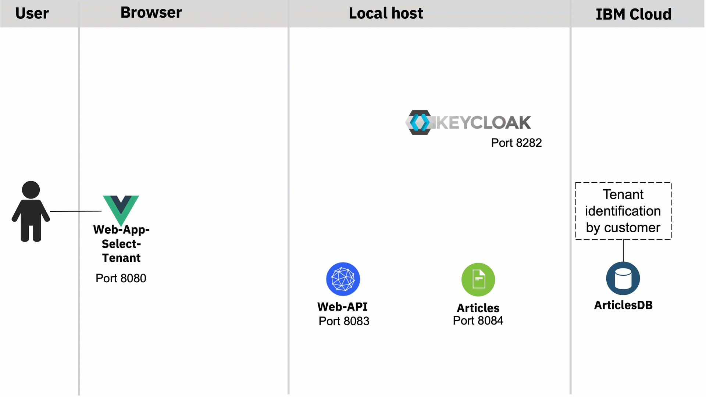

# Extract tenant and reconfigure OIDC configuration with Quarkus for Keycloak

This implementation detail is structed in objective, basic use case definition, architecture, multi tenancy realization, technologies and implementation.¶

### Objective¶

I wanted to get started to implement an very simple microservices based application example for multi tenancy. With a basic use case defined for this example application.

The starting point from the technical and usage perspective is this workshop [`Get started to deploy a Java Microservices application to Code Engine`](https://suedbroecker.net/2021/05/28/new-hands-on-workshop-get-started-to-deploy-a-java-microservices-application-to-code-engine/).

### Basic Use Case

This is the simple basic use case defined in the first step for the example application.

#### Short Description 

Get articles displayed based on your email domain, user role and user authentication and authorization.

#### Basic Flow

1. Insert email address
2. Based on the domain of your email address you are routed to the right tenant ( example `blog.de` and `blog.com`)
3. Login to the right realm on the Identity and Access Management system
4. The articles are displayed according to the user role and tenant.

* Example basic flow implementation (local machine)


### Architecture



The gif shows a basic overview of the dependencies in following sequence:

1. Invoke `web-app-select` on `port 8080` and insert your email to select the domain for the tenant ((blog.de == tenantA) and (blog.com == tenantA))

2. The related webfronted for `blog.de` is invoked, it's `web-app-tenant-a` (`port 8081`) that redirects to the right Keycloak realm (tenant-A) which provides the login and returns the access-token. We use that token to access the `web-api` microservice (`port 8083`). Therefor we invoke the `web-api` REST endpoint related to the right tenant (realm), in this case it's tenant-a. (`user:alice;role:user` in both realms)

3. The microservice `web-api` uses the the functionalities for multitenancy [provided by Quarkus](https://quarkus.io/guides/security-openid-connect-multitenancy) for the **validation of the access token** at right Keycloak realm and **forwards the given access-token** to the microservice articles, by using the right REST endpoint for the given tenant.

4. The `articles` microservice does the same validation as `web-api` using [Quarkus](https://quarkus.io/guides/security-openid-connect-multitenancy) and uses the right query to provide the needed articles data from the Cloudant database.

### Multi tenancy realization

* Varibale frontends for each domain
* Microservice using [Quarkus Security OpenID Connect Multi Tenancy](https://quarkus.io/guides/security-openid-connect-multitenancy)
* Database will have an editional entry to seperate the domains
* Identity and access management will be manage be different Keycloak realms

### Technologies

The example application currently uses following technologies.

* Identity and Access Management ([Keycloak](https://www.keycloak.org))
* Multi Tenancy ([Quarkus Security OpenID Connect Multi Tenancy](https://quarkus.io/guides/security-openid-connect-multitenancy))
* Microservies ([Quarkus](https://quarkus.io))
* Web frontend [Vue.js](https://vuejs.org) (Web frontend with JavaScript)
* (optional a Database) [Cloudant](https://www.ibm.com/cloud/cloudant)

### Implementation

Using the [Quarkus Security OpenID Connect Multi Tenancy](https://quarkus.io/guides/security-openid-connect-multitenancy) for the  multi tenancy of the java microservices.
Here we focus only on the simple implementation for the `web-api` microservice.

These are the steps:

1. Provide a REST endpoint for each tenant
2. Extract inside the invoked endpoint the JWT access-token and set the right configuration for the given tenant, that means in this case the Keycloak realm.
3. Based on the known tenant invoke the right endpoint of the `articles service`.
    1. Create REST client for each tenant
    2. Invoke the right client


### Provide  REST endpoint for each tenant

Relevant code in [ArticleResource.java](https://github.com/thomassuedbroecker/ce-cns-multi-tenant/blob/master/code/web-api-tenant/src/main/java/com/ibm/webapi/ArticleResource.java) of the web-api service.

In this case two endpoints:

* `@Path("/articlesA")`
* `@Path("/articlesB")`

```java
   @GET
    @Path("/articlesA")
    @Produces(MediaType.APPLICATION_JSON)
    //@Authenticated
    @RolesAllowed("user")
    @NoCache
    public List<Article> getArticlesA() {
        try {
            List<CoreArticle> coreArticles = articlesDataAccess.getArticles(5);
            System.out.println("-->log: com.ibm.webapi.ArticleResource.getArticles -> articlesDataAccess.getArticles");
            return createArticleList(coreArticles);
        } catch (NoConnectivity e) {
            System.err.println("-->log: com.ibm.webapi.ArticleResource.getArticles: Cannot connect to articles service");
            throw new NoDataAccess(e);
        }
    }

    @GET
    @Path("/articlesB")
    @Produces(MediaType.APPLICATION_JSON)
    //@Authenticated
    @RolesAllowed("user")
    @NoCache
    public List<Article> getArticlesB() {
        try {
            List<CoreArticle> coreArticles = articlesDataAccess.getArticles(5);
            System.out.println("-->log: com.ibm.webapi.ArticleResource.getArticles -> articlesDataAccess.getArticles");
            return createArticleList(coreArticles);
        } catch (NoConnectivity e) {
            System.err.println("-->log: com.ibm.webapi.ArticleResource.getArticles: Cannot connect to articles service");
            throw new NoDataAccess(e);
        }
    }
```

###  Extract JWT access-token and set the right configuration

Extract inside the invoked endpoint the JWT access-token and set the right configuration for the given tenant, that means in this case the Keycloak realm.

Relevant code in [CustomTenantConfigResolver.java](https://github.com/thomassuedbroecker/ce-cns-multi-tenant/blob/master/code/web-api-tenant/src/main/java/com/ibm/webapi/CustomTenantConfigResolver.java) of the web-api service.

* `"articlesA".equals(parts[1])`
* `"articlesB".equals(parts[1])`

```java
package com.ibm.webapi;

import javax.enterprise.context.ApplicationScoped;

// Tenant
//import io.quarkus.oidc.TenantResolver;
import io.quarkus.oidc.TenantConfigResolver;
import io.quarkus.oidc.OidcTenantConfig;
import io.vertx.ext.web.RoutingContext;

@ApplicationScoped
public class CustomTenantConfigResolver implements TenantConfigResolver {
   
    @Override
    public OidcTenantConfig resolve(RoutingContext context) {
        System.out.println("-->log: com.ibm.web-api.CustomTenantResolver.resolve : " + context.request().path());
        String path = context.request().path();
        String[] parts = path.split("/");

        if (parts.length == 0) {
            // resolve to default tenant configuration
            return null;
        }

        if ("articlesA".equals(parts[1])) {
            OidcTenantConfig config = new OidcTenantConfig();

            System.out.println("-->log: com.ibm.web-api.CustomTenantResolver.resolve A: " + config.getToken().getIssuer().toString());

            config.setTenantId("tenantA");
            config.setAuthServerUrl("http://localhost:8282/auth/realms/tenantA");
            config.setClientId("backend-service");
            OidcTenantConfig.Credentials credentials = new OidcTenantConfig.Credentials();
            credentials.setSecret("secret");
            config.setCredentials(credentials);

            System.out.println("-->log: com.ibm.web-api.CustomTenantResolver.resolve A: " + config.toString());


            // any other setting support by the quarkus-oidc extension

            return config;
        }

        if ("articlesB".equals(parts[1])) {
            System.out.println("-->log: com.ibm.web-api.CustomTenantResolver.resolve");           
            OidcTenantConfig config = new OidcTenantConfig();
 
            System.out.println("-->log: com.ibm.web-api.CustomTenantResolver.resolve issuer: " + config.getToken().getIssuer().toString());
            
            config.setTenantId("tenantB");
            config.setAuthServerUrl("http://localhost:8282/auth/realms/tenantB");
            config.setClientId("backend-service");
            OidcTenantConfig.Credentials credentials = new OidcTenantConfig.Credentials();
            credentials.setSecret("secret");
            config.setCredentials(credentials);

            System.out.println("-->log: com.ibm.web-api.CustomTenantResolver.resolve B: " + config.toString());

            // any other setting support by the quarkus-oidc extension

            return config;
        }


        return null;
    }
}
```

### Based on the known tenant invoke the right endpoint of the articles service


#### Create REST client for each tenant

Relevant code in [ArticlesDataAccess.java](https://github.com/thomassuedbroecker/ce-cns-multi-tenant/blob/master/code/web-api-tenant/src/main/java/com/ibm/webapi/ArticlesDataAccess.java) of the web-api service.

```java
URI apiV1 = null;

        apiV1 = UriBuilder.fromUri(articles_url_tenant_A).build();
        System.out.println("-->log: com.ibm.web-api.ArticlesDataAccess.initialize URI (tenantA) : " + apiV1.toString());
        articlesServiceA = RestClientBuilder.newBuilder()
                .baseUri(apiV1)
                .register(ExceptionMapperArticles.class)
                .build(ArticlesService.class);
                
        apiV1 = UriBuilder.fromUri(articles_url_tenant_B).build();
        System.out.println("-->log: com.ibm.web-api.ArticlesDataAccess.initialize URI (tenantB) : " + apiV1.toString());
        articlesServiceB = RestClientBuilder.newBuilder()
                .baseUri(apiV1)
                .register(ExceptionMapperArticles.class)
                .build(ArticlesService.class);     
```

#### Invoke the right client

Relevant code in [ArticlesDataAccess.java](https://github.com/thomassuedbroecker/ce-cns-multi-tenant/blob/master/code/web-api-tenant/src/main/java/com/ibm/webapi/ArticlesDataAccess.java) of the web-api service.

```java
String tenant = tenantJSONWebToken();
            System.out.println("-->log: com.ibm.web-api.ArticlesDataAccess.getArticles (tenant): " + tenant );

            if ("tenantA".equals(tenant)){
                System.out.println("-->log: com.ibm.web-api.ArticlesDataAccess.getArticles " + tenant);
                return articlesServiceA.getArticlesFromService(amount);
            }
    
            if ("tenantB".equals(tenant)){
                System.out.println("-->log: com.ibm.web-api.ArticlesDataAccess.getArticles " + tenant);
                return articlesServiceB.getArticlesFromService(amount);
            } else {
              System.out.println("-->log: com.ibm.web-api.ArticlesDataAccess.getArticles(NO TENANT)");
              return null;
            } 
```