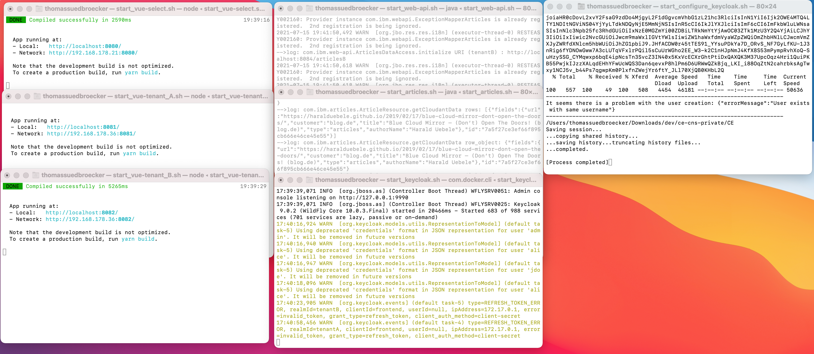

# Run example locally

### Prerequisites

#### Environment

* Local

    * OS: Mac OS
    * Visual Studio Code (optional)

    * You need to you have installed on you MacOS:

        * Java: openjdk version "11.0.11"
        * Docker Desktop: "3.4"
        * Apache Maven: "3.8.1"
        * Vue.js: vue/cli "4.5.13"

### Steps

You should be able to simply run the example locally.

##### Step 1: Clone the project

```sh
git clone https://github.com/thomassuedbroecker/ce-cns-multi-tenant
cd ce-cns-multi-tenant/CE
git fetch --all
git checkout appid-migration-test
```

##### Step 2: Start the example with a bash script

```sh
bash local-start-appid.sh
```

This bash script will start seven terminals:
 
* Web-App tenant A (port 8080)
* Web-API microservice (port 8083)
* Articles microservice (port 8084)

The image below shows the terminal sessions:



* one browser sessions
    * Web-App select `http://localhost:8080/` 

##### Step 4: Login to App ID

  Use following:

  - User: `XXX` Password: `XXX`


Verify you App ID configuration.