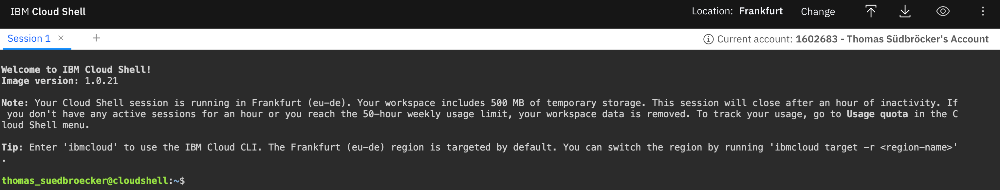

# Automated setup of IBM Cloud App ID using a bash script

These are some of the implementation details of an example bash script to automate the setup for an [IBM Cloud App ID](https://www.ibm.com/cloud/app-id) service instance.

> _"IBM Cloud App ID allows you to easily add authentication to web and mobile apps. You no longer have to worry about setting up infrastructure for identity, ensuring geo-availability, and confirming compliance regulations. Instead, you can enhance your apps with advanced security capabilities like multifactor authentication and single sign-on."_ Resouce from the [IBM Cloud App ID](https://www.ibm.com/cloud/app-id) webpage (2021/10/06)

The bash script utilies following APIs and ClIs:

* [AppID swagger API documentation](https://us-south.appid.cloud.ibm.com/swagger-ui/#/).
* [IBM Cloud CLI](https://cloud.ibm.com/docs/cli?topic=cli-getting-started)

The script creates one instance of the [IBM Cloud App ID](https://www.ibm.com/cloud/app-id) service and does the configuration.

The example setup uses the IBM Cloud Shell and a `PayAsYouGo` IBM Cloud Account, but for the App ID service instance we will use the lite plan which is for free. 

> Please take about the offical documentation for each IBM Cloud Services and IBM Cloud Account Type definitions, before you start.

Simplified steps:

1. Create a `PayAsYouGo` IBM Cloud Account
2. Open the IBM Cloud shell
3. Clone the github project
4. Execute one bash script
5. Verify the newly created App ID service instance in IBM Cloud

     * application
     * scope 
     * roles
     * users
     * login headline
     * logo
     * color

### Here are the steps you can follow to execute the example bash script

#### Step 1: Create a `PayAsYouGo` IBM Cloud Account

Open this [link](https://ibm.biz/BdfXAn) and follow the guided steps.

#### Step 2: Open the `IBM Cloud Shell`

When using the IBM Cloud Shell, no client-side setup is required for this workshop, it comes with all necessary CLIs (command line tools).

Use following link to directly open the `IBM Cloud Shell`.

<https://cloud.ibm.com/shell>

In your browser, login to the [IBM Cloud](https://cloud.ibm.com) Dashboard and open the IBM Cloud Shell from here:


_Note:_ Your workspace includes 500 MB of temporary storage. This session will close after an hour of inactivity. If you don't have any active sessions for an hour or you reach the 50-hour weekly usage limit, your workspace data is removed.

#### Step 2: Verify the open `IBM Cloud Shell`

Now you are logged on with your IBM Cloud account.



#### Step 3: Clone the github project into the `IBM Cloud Shell`

```sh
git clone https://github.com/thomassuedbroecker/automated-setup-of-ibmcloud-appid
```

#### Step 4: Navigate to the project directory

```sh
cd automated-setup-of-ibmcloud-appid/scripts
```

#### Step 5: Execute the bash script `setup-appid.sh`

```sh
bash setup-appid.sh
```

#### Step 6: Verify the created App ID service instance


### What happens behind the curtain?

Here is some background information what the script does.
The [Bash](https://en.wikipedia.org/wiki/Bash_(Unix_shell)) script uses [`cURL`](https://en.wikipedia.org/wiki/CURL), [sed](https://en.wikipedia.org/wiki/Sed) and [grep](https://en.wikipedia.org/wiki/Grep) commands and the * [AppID REST API](https://us-south.appid.cloud.ibm.com/swagger-ui/#/). The steps do contain also an example content for the [JSON](https://en.wikipedia.org/wiki/JSON) [payload](https://en.wikipedia.org/wiki/Payload) which will be upload. In the GitHub project you will file the JSON files I prepared for that example.

* Application name: `myexamplefrontend`
* Role name: `tenant_user_access`
* Scope name: `tenant_scope`
* 

#### Step 1: It configures `region` and `resource group`

For that task it uses the IBM Cloud CLI.

```sh
ibmcloud target -g $RESOURCE_GROUP
ibmcloud target -r $REGION
```

#### Step 2: It creates a service instance

For that task it uses the IBM Cloud CLI using `ibmcloud resource service-instance-create`.

```sh
ibmcloud resource service-instance-create $YOUR_SERVICE_FOR_APPID $APPID_SERVICE_NAME $SERVICE_PLAN $REGION
```

#### Step 3: Then it creates a service key for the AppID service

The service key contains needed configuration and access information we need to configure the service.

```sh
ibmcloud resource service-key-create $APPID_SERVICE_KEY_NAME $APPID_SERVICE_KEY_ROLE --instance-name $YOUR_SERVICE_FOR_APPID
```

#### Step 5: Configure AppID service

#### a. Set identity providers

Deactivate Google, Custom and Facebook as identity providers.

```sh
OAUTHTOKEN=$(ibmcloud iam oauth-tokens | awk '{print $4;}')
result=$(curl -d @./idps-custom.json -X PUT -H "Content-Type: application/json" -H "Authorization: Bearer $OAUTHTOKEN" $MANAGEMENTURL/config/idps/custom)
```

The files do contain following format.

```json
{
    "isActive": false
}
```

Format to enable Cloud Directory as identity provider.

```json
{
  "isActive": true,
  "config": {
    "selfServiceEnabled": true,
    "signupEnabled": true,
    "interactions": {
      "identityConfirmation": {
        "accessMode": "FULL",
        "methods": [
          "email"
        ]
      },
      "welcomeEnabled": false,
      "resetPasswordEnabled": false,
      "resetPasswordNotificationEnable": true
    },
    "identityField": "email"
  }
}
```

#### b. Create application

```sh
result=$(curl -d @./$ADD_APPLICATION -H "Content-Type: application/json" -H "Authorization: Bearer $OAUTHTOKEN" $MANAGEMENTURL/applications)
```

Format to upload an application

```json
{
    "name": "cns-ce-example",
    "type": "singlepageapp"
}
```

#### c. Add scope

```sh
result=$(curl -d @./$ADD_SCOPE -H "Content-Type: application/json" -X PUT -H "Authorization: Bearer $OAUTHTOKEN" $MANAGEMENTURL/applications/$APPLICATION_CLIENTID/scopes)
``` 

Format to upload the scope.

```json
{
  "scopes": [
    "cns_example_scope"
  ]
}
```

#### d. Add role

```sh
#Create file from template
sed "s+APPLICATIONID+$APPLICATION_CLIENTID+g" ./add-roles-template.json > ./$ADD_ROLE
OAUTHTOKEN=$(ibmcloud iam oauth-tokens | awk '{print $4;}')
#echo $OAUTHTOKEN
result=$(curl -d @./$ADD_ROLE -H "Content-Type: application/json" -X POST -H "Authorization: Bearer $OAUTHTOKEN" $MANAGEMENTURL/roles)
``` 

Format to upload a role.

```json
{
  "name": "ce_user_access",
  "description": "This is an example role.",
  "access": [
    {
      "application_id": "APPLICATIONID",
      "scopes": [
        "cns_example_scope"
      ]
    }
  ]
}
```

#### e. Import users

```sh
result=$(curl -d @./$USER_IMPORT_FILE -H "Content-Type: application/json" -X POST -H "Authorization: Bearer $OAUTHTOKEN" $MANAGEMENTURL/cloud_directory/import?encryption_secret=$ENCRYPTION_SECRET)
```

Format of an exported user, which will be imported.

```json
{"itemsPerPage":1,"totalResults":1,"users":[{"scimUser":{"originalId":"7cdf7ac3-371f-4b4c-8d0a-81e479ab449b","name":{"givenName":"Thomas","familyName":"Example","formatted":"Thomas Example"},"displayName":"Thomas Example","active":true,"emails":[{"value":"thomas@example.com","primary":true}],"passwordHistory":[{"passwordHash":"L6EEYnQANBPSBF0tDCPDZl4uVD07H3Ur8qIVynB1Ht4Bn4s/x0lA6kvyJxEPr/06m5hi5wdLM45JtYDlT8M0hjVIBI3YpXRR9J4oXZA/Yt/V13yjsUPsXKek6RWdOKWp+wuD5w3Bobh43QbRR3dXFoKUbcLVWQoKLWqvRATMQis=","hashAlgorithm":"PBKDF2WithHmacSHA512"}],"status":"CONFIRMED","passwordExpirationTimestamp":0,"passwordUpdatedTimestamp":0,"mfaContext":{}},"passwordHash":"L6EEYnQANBPSBF0tDCPDZl4uVD07H3Ur8qIVynB1Ht4Bn4s/x0lA6kvyJxEPr/06m5hi5wdLM45JtYDlT8M0hjVIBI3YpXRR9J4oXZA/Yt/V13yjsUPsXKek6RWdOKWp+wuD5w3Bobh43QbRR3dXFoKUbcLVWQoKLWqvRATMQis=","passwordHashAlg":"PBKDF2WithHmacSHA512","profile":{"attributes":{}},"roles":["ce_user_access"]}]}
```

#### f. Add redirect URLs

```sh
OAUTHTOKEN=$(ibmcloud iam oauth-tokens | awk '{print $4;}')
result=$(curl -d @./$ADD_REDIRECT_URIS -H "Content-Type: application/json" -X PUT -H "Authorization: Bearer $OAUTHTOKEN" $MANAGEMENTURL/config/redirect_uris)
```

```json
{
    "redirectUris": [
      "http://localhost:8080/*",
      "APPLICATION_REDIRECT_URL/*"
    ],
    "additionalProp1": {}
}
```


